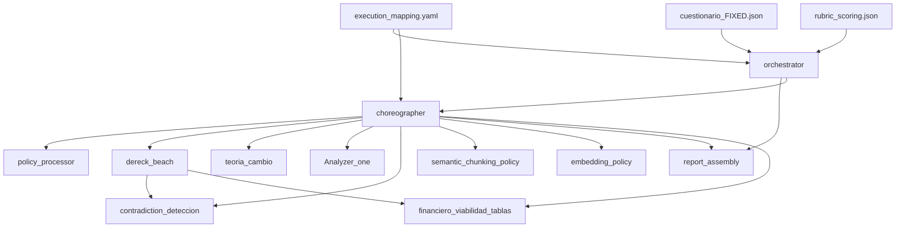

# Dependency Graph (DAG)

## System Architecture

```mermaid
graph TD
    META1[execution_mapping.yaml]
    META2[cuestionario_FIXED.json]
    META3[rubric_scoring.json]

    dereckbeach[dereck_beach]
    policyprocessor[policy_processor]
    embeddingpolicy[embedding_policy]
    semanticchunkingpolicy[semantic_chunking_policy]
    teoriacambio[teoria_cambio]
    contradictiondeteccion[contradiction_deteccion]
    financieroviabilidadtablas[financiero_viabilidad_tablas]
    reportassembly[report_assembly]
    Analyzerone[Analyzer_one]
    orchestrator[orchestrator]
    choreographer[choreographer]

    META1 --> orchestrator
    META2 --> orchestrator
    META3 --> orchestrator
    META1 --> choreographer

    dereckbeach --> contradictiondeteccion
    dereckbeach --> financieroviabilidadtablas
    orchestrator --> reportassembly
    orchestrator --> choreographer
    choreographer --> policyprocessor
    choreographer --> dereckbeach
    choreographer --> teoriacambio
    choreographer --> Analyzerone
    choreographer --> contradictiondeteccion
    choreographer --> semanticchunkingpolicy
    choreographer --> embeddingpolicy
    choreographer --> reportassembly
    choreographer --> financieroviabilidadtablas

    classDef orphan fill:#f99,stroke:#333,stroke-width:2px
```

## Statistics

- Total files analyzed: 11
- Total LOC: 12,950
- Orphaned files: 0
- Active dependencies: 13